Figure scripts read `<DATA_ROOT>/data/outputs/` and write to `50_plots/`. None trains a
model. Output file names contain the display item (`FIG-N`, `TABLE-N`, `SUPPFIG-N`,
`SUPPTABLE-N`, `SUPPDATA-N`). Most figure scripts also write the plotted values to a
`_DATA.csv` file. The
[data flow chart](data_flow.html) traces each figure back to the data it is built from.

| Script | Display item | Reads |
|--------|--------------|-------|
| `51_fig-1_worldmap_mat_map_era5.py` | Fig. 1, site map and climate | `10_datasets/17_..._era5.csv`, `20_subsets/21_...csv` |
| `52_fig-2+suppfig-1+7_flameplots.py` | Fig. 2, the VPD effect on NEP over the TA, SM and ET grids; Supplementary Fig. 1, the TA and SM effects; Supplementary Fig. 7, the flux maps. `FIGURE` selects the item | `40_aggregation/` |
| `53_fig-3+suppfig-3_sankeyplot_shapvalues_8stages.py` | Fig. 3, driver effects across the stages; Supplementary Fig. 3 with `VARIANT = "mirrored-stages"` | `40_aggregation/` |
| `54_fig-4+supptable-7_vpd_response_curve_shap_agg.py` | Fig. 4, the VPD response curve; Supplementary Table 7, coefficients and thresholds in σ and kPa | `40_aggregation/`, `40_aggregation/41_...`, `20_subsets/` |
| `55_table-1+suppfig-4_threshold_robustness.py` | Table 1, fifteen of the eighteen tests; Supplementary Fig. 4, all eighteen | `40_aggregation/47_...csv` |
| `56_suppfig-2+supptable-6_scenarios_boxplot_shapsums.py` | Supplementary Fig. 2, per-site effects across the stages; Supplementary Table 6, stage means and SD | `40_aggregation/` |
| `57_suppfig-5_ale_response_curve.py` | Supplementary Fig. 5, ALE curves | `40_aggregation/46_...` |
| `58_suppfig-6_vpd_response_by_flux.py` | Supplementary Fig. 6, the VPD response of NEP, GPP, RECO and ET | `40_aggregation/` per flux, `20_subsets/` |
| `59_supptable-4+5_stage_distributions+min_records.py` | Supplementary Table 4, driver distributions per stage; Supplementary Table 5, (a) the minimum-records sweep and (b) the matched Stage 7 to 8 comparison | `40_aggregation/45_...csv`, `30_shap/`, `80_info/89_...csv` |
| `60_suppfig-8_threshold_exceedance.py` | Supplementary Fig. 8, share of half-hours above the threshold | `40_aggregation/48_...csv`, `47_...csv` |
| `61_supptable-3_stage_cutoff_percentiles.py` | Supplementary Table 3, stage definitions checked against `src/stages.py`, with the cut-off percentiles of script 87 | `80_info/87_...csv` |
| `62_supptable-9_threshold_definitions.py` | Supplementary Table 9, peak, steepest decline and zero crossing | `80_info/81_...csv` |
| `63_supptable-8_threshold_vs_site_vpd_range.py` | Supplementary Table 8, per-site threshold by quartile of site maximum VPD | `80_info/82_...csv` |
| `64_suppdata-2_site_skill.py` | Supplementary Data 2, site model skill under both cross-validation splits | `80_info/86_...csv`, `20_subsets/` |
| `65_suppfig_biome_threshold_distributions.py` | Per-site thresholds by forest type, not in the manuscript | `40_aggregation/49_...csv` |
| `66_suppfig-10_data_flow_sankey.py` | Supplementary Fig. 10, records retained at each filter | `20_subsets/22_data_flow.csv` |
| `67_suppdata-1_data_flow_per_site.py` | Supplementary Data 1, record losses per site | `20_subsets/22_data_flow.csv` |
| `68_suppfig-9_site_curves_kpa.py` | Supplementary Fig. 9, the VPD responses of the 207 sites with a crossing from positive to negative, on one kPa axis with the per-site crossings | `40_aggregation/41_...`, `47_...csv`, `49_...csv`, `20_subsets/` |
| `69_supptable-10_factorial_sm_vpd.py` | Supplementary Table 10, SM and VPD effects in four soil water classes by four VPD classes | `40_aggregation/.../factorial-cells/44_...csv` |

Supplementary Table 1, the list of sites with their data references, was assembled by
hand from the outputs of stages 17 and 21. Supplementary Table 2, the per-site statistics, comes
from the stage 21 subsets table. Script 91 copies the data behind every display item
into the Source Data archive (see [Data](data.qmd#deposited-outputs)).

## Figure 4 aggregation

Script 41 averages the SHAP values within each cell of the site grid (`aggfunc = 'mean'`),
and script 54 fits the curve to the cross-site median per bin of the script 42 output. For
the two bin coordinate columns, script 42 stores the `median` (`src/aggregation.py`). These
columns hold the lower bin edge, which is the same at every site in a cell. The median
avoids floating-point noise in the labels and does not affect the SHAP values.

The error bars show the standard error of the cross-site median in each cell, the standard
deviation of the median over 1,000 bootstrap resamples of the sites (seed 42,
`src/aggregation.py::median_se_across_sites`). Panel a resamples all sites, panels b to e the
sites of their forest type. The bootstrap needs the per-site cell means, and script 54 therefore also
reads the stage 41 file, as script 68 does. Each bar starts at the marker edge and does not
show through the semi-transparent marker.

## Table 1 and Supplementary Fig. 4

Script 47 computes the eighteen tests and writes `47_THRESHOLD_Robustness_NEP_ZSCORE.csv`.
Script 55 draws both the table and the figure from that file.

| Group | Tests |
|---|---|
| Soil water depth | deepest usable layer at all sites; the 128 sites with a deeper layer at their shallowest and deepest; the 59 sites with five or more layers at their shallowest and deepest |
| Model fitting | TA excluded from the model; blocked cross-validation; mean instead of median per bin; penalized spline instead of the polynomial; ALE instead of SHAP; 23 estimator settings |
| Site set | each site removed in turn; Europe, North America and both removed; records of at least 3, 5 and 10 years |

Each row gives the test, the number of sites, the threshold in σ and in kPa, and the
95 percent prediction band of the fit. Every row converts to kPa with its own site set.
Three rows have another interval. Supplementary Fig. 4 draws it as whiskers, and Table 1 marks it with an asterisk (Table 1 omits the estimator row):

- estimator row: the range across its 23 settings
- leave-one-site-out row: the range across the 208 removals
- ALE row: the confidence interval of the mean of the per-site crossings

Script 47 also writes a bootstrap interval over sites (`boot_lower`, `boot_upper`). It is
narrower than the prediction band in every other row and is not shown.

`MAIN_ROWS` in script 55 selects the fifteen rows of Table 1: all tests except the estimator
row and the records of at least 3 and 5 years.

## Script 57 settings

| Setting | Default | Effect |
|---------|---------|--------|
| `PLOT_FEATURE` | `VPD_ZSCORE` | Predictor on the x axis |
| `FLUX` | `NEP_ZSCORE` | Target |
| `USE_MEDIAN` | `False` | Mean curve across sites, used only for the axis ranges. `True` uses the median |
| `USE_CI` | `True` | 95 percent interval in the labels. `False` uses the standard error |
| `VARIANT` | `""` | Run variant to read |

## Figures of the paper

Script 95 writes web-size copies of the figures to `docs/figures/`. The
full-resolution files and the data behind each figure are in the deposit (see
[Data](data.qmd#deposited-outputs)). The legends are in the paper. The tables are not
reproduced here. They are in the paper and its supplement, and their data are in
`ms-forests-vpd_SourceData.zip` of the deposit, one or more files per table
(`Table1.csv`, `SupplementaryTable6.xlsx`).

### Fig. 1

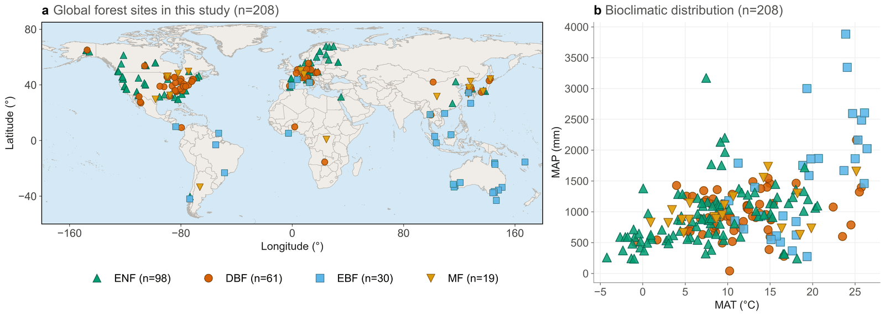

### Fig. 2

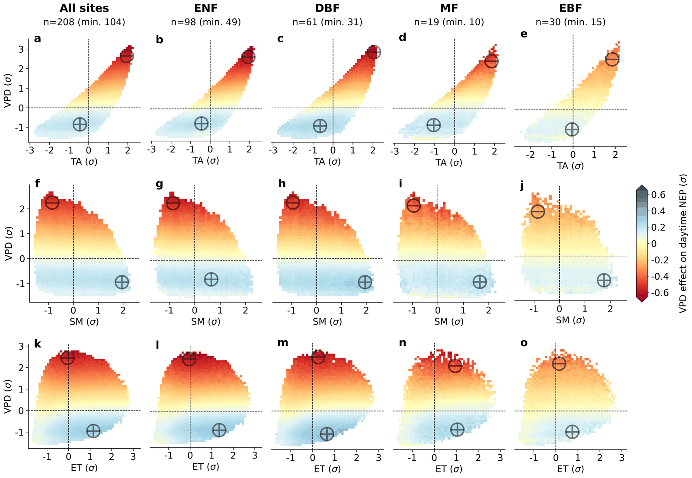

### Fig. 3

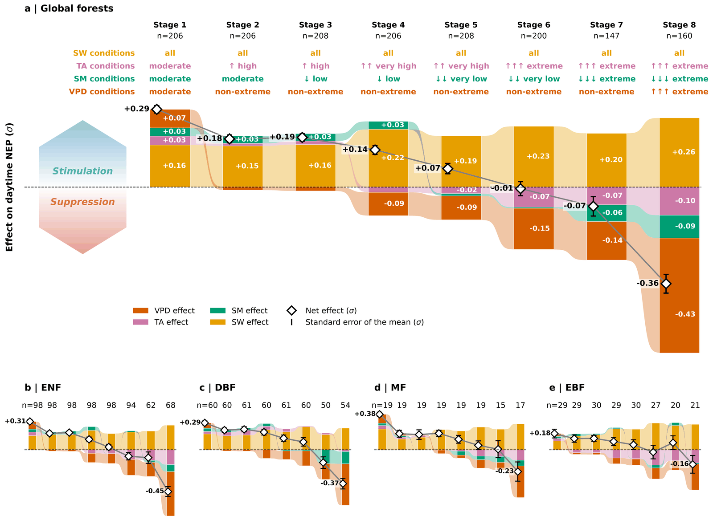

### Fig. 4

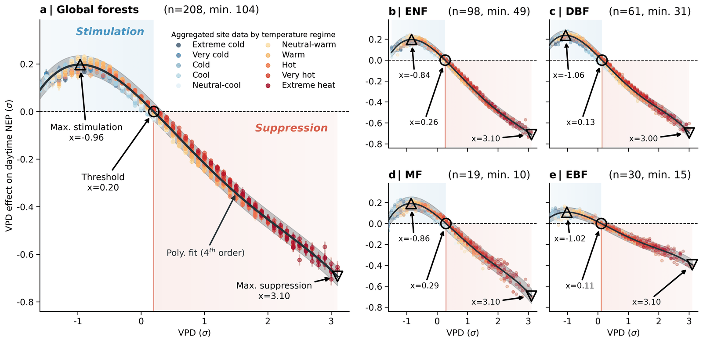

### Supplementary Fig. 1

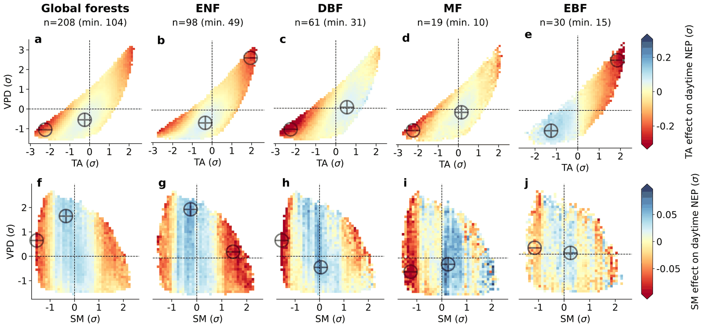

### Supplementary Fig. 2

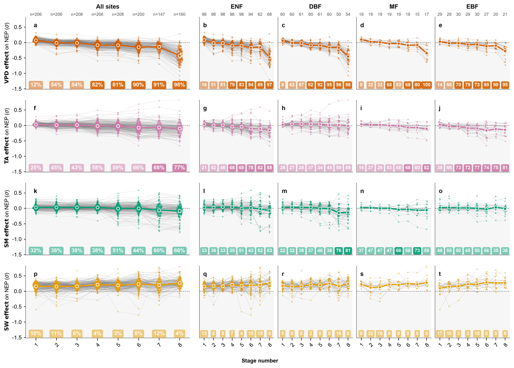

### Supplementary Fig. 3

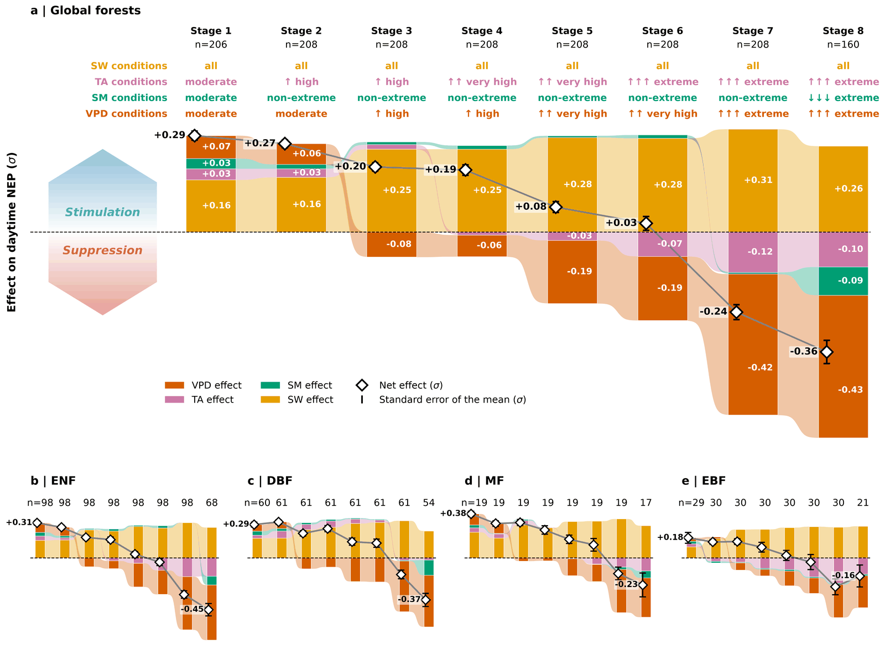

### Supplementary Fig. 4

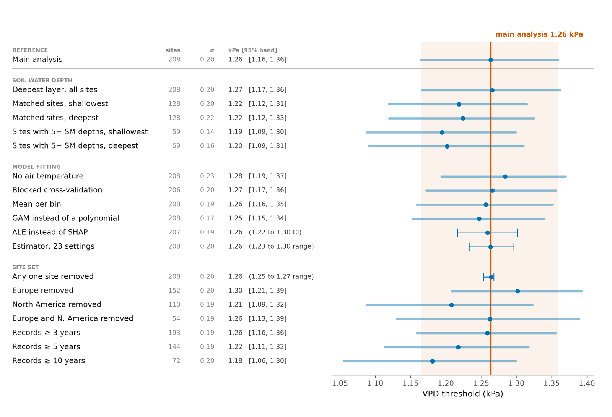

### Supplementary Fig. 5

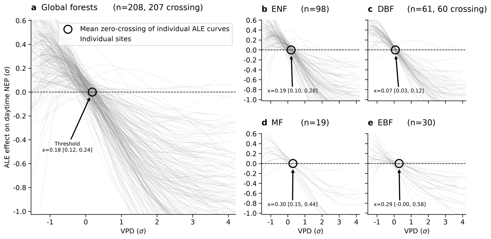

### Supplementary Fig. 6

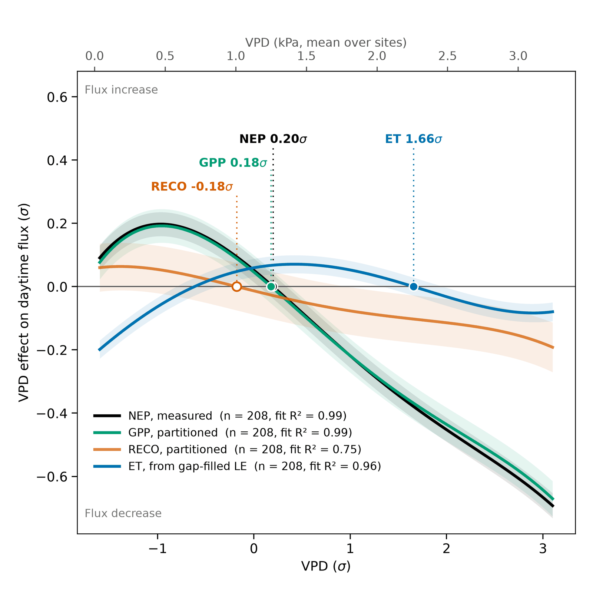

### Supplementary Fig. 7

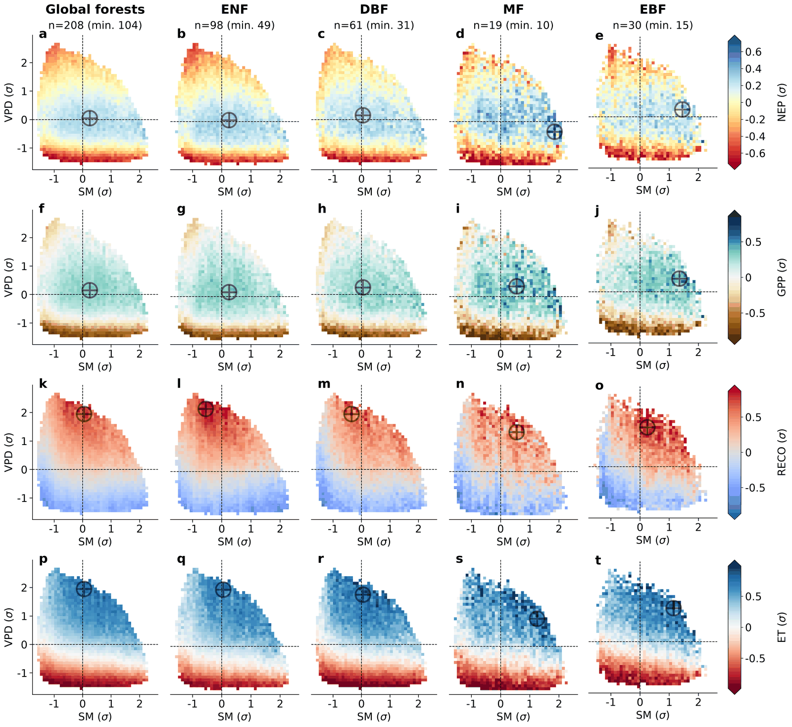

### Supplementary Fig. 8

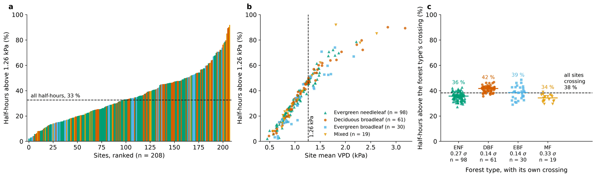

### Supplementary Fig. 9

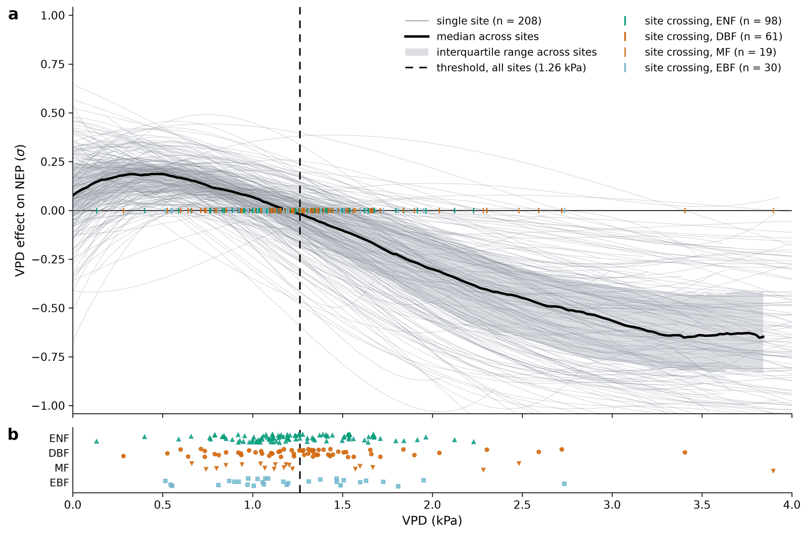

### Supplementary Fig. 10

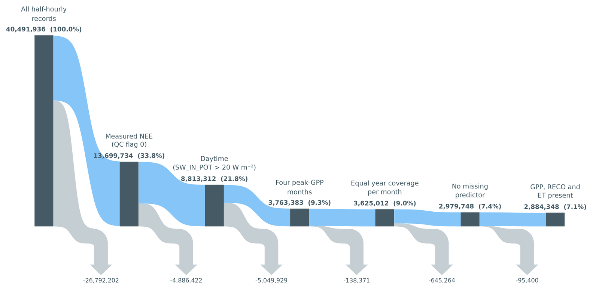
